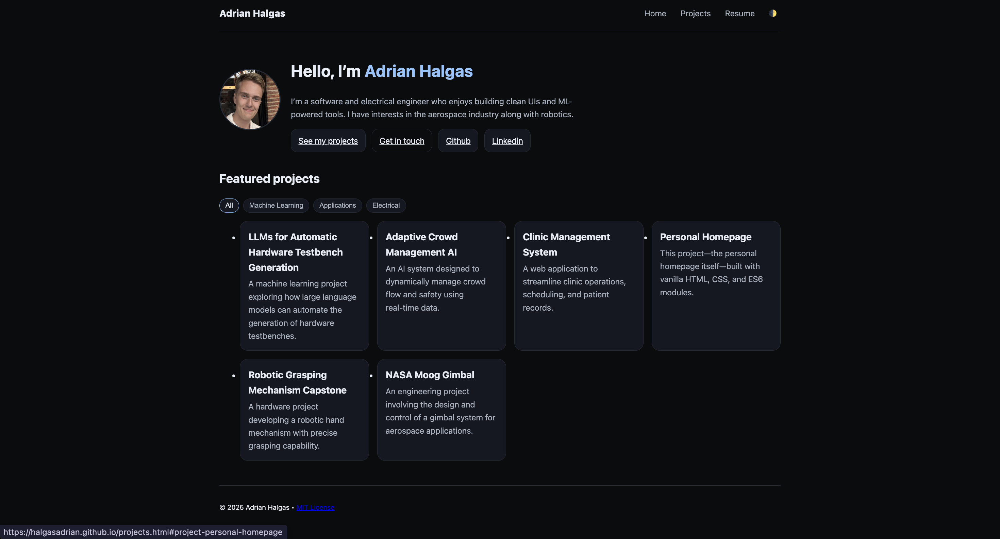

# Project 1 — Personal Homepage

## Author

Adrian Halgas  
Class: CS5610 Web Development

## Project Objective

Build and deploy a personal portfolio website using **vanilla HTML5**, **CSS3**, and **ES6 modules**.  The site acts as a professional portfolio that presents information about me and my projects, work experience, education, and skills—and provides an engaging way for potential employers or collaborators to learn more.

The project emphasises accessibility, semantic markup, responsive design, and clear organisation of assets.  It uses no backend services or third‑party component libraries; all interactivity is implemented with plain JavaScript modules.

## Live Demo

- **Site:** https://halgasadrian.github.io/

- **Video Demo:** https://youtu.be/YxPewl2SiZ0

## Screenshot




## Design Document

The design document outlines the goals, user research, and interface concepts guiding development.  It consists of four key parts: a project description, user personas, user stories, and design mockups.

### Project Description

This personal homepage is a **static portfolio** that presents a concise professional profile.  It includes a **home page** introducing me with a profile photo, a brief bio, and links to my projects and resume; a **projects page** grouping my work into categories (Machine Learning, Applications, Electrical) with interactive cards that expand to reveal a longer description, objectives, technical details and a photo; and a **resume page** listing my education, skills, work experience, awards and certifications.  The site includes a dark/light theme toggle and a tag filter on the home page to make browsing projects effortless.

### User Personas

A *user persona* is a model representing a defined type of product users, capturing key attributes such as motivations, goals and challenges.  Personas help design teams make user‑centred decisions. Here, I considered three different personas:

1. **Riley Recruiter** – a technology recruiter who wants to quickly evaluate a candidate’s skills and download a resume. Riley values concise summaries, intuitive navigation and working links.
2. **Morgan Manager** – a hiring manager in robotics who wants to see depth of knowledge, problem‑solving ability and cross‑disciplinary experience.  Morgan reads full project write‑ups, including key objectives and technical approach.
3. **Alex Student** – a fellow student seeking inspiration and guidance.  Alex browses on mobile, plays with interactive features such as dark/light mode and uses the tag filter to find areas of interest.

### User Stories

User stories translate these personas’ needs into concise requirements. Each story combines a persona, a need, and a reason. Example stories include:

- **As Riley Recruiter,** I want to filter projects by category and read short summaries so that I can quickly shortlist candidates.  *Acceptance:* category buttons filter the project grid, each card shows a title and description, clicking a card expands only that project.
- **As Morgan Manager,** I want to open a project and read its objectives and technical approach so that I can assess the candidate’s problem‑solving.  *Acceptance:* every project has its own anchor, visiting a link such as `projects.html#project-llms-testbench` expands the corresponding card, the expanded card spans the full width and includes an image, long description, objectives list and technical section.
- **As Alex Student,** I want to view the site comfortably on my phone and toggle between light and dark themes so that I can explore on the go.  *Acceptance:* the layout adapts to narrow screens; navigation and buttons are touch‑friendly; the theme toggle works across pages and remembers my preference.
- **As Riley Recruiter,** I want to download a PDF resume directly from the site so that I can share it with colleagues.  *Acceptance:* a prominent download button is present on the résumé page, the PDF includes contact details and a narrative of experience.

### Design Mockups

Design mockups help visualise layout and hierarchy before implementation. Below is a wireframe:

- **Home page** with a header, a hero section (avatar on the left, introduction text on the right), call‑to‑action buttons (Projects, Contact, GitHub) and a featured projects section with category filter buttons and project cards.
- **Projects page** with category headings (Machine Learning, Applications, Electrical), a responsive grid of project cards, and an expanded card spanning the full width with an image, long description, objectives, and technical approach.
- **Résumé page** with clear sections (Summary, Skills chips, Education with logos, Experience entries, Projects, Awards) and a top toolbar with a download button.

Create your wireframe images using your preferred tool (e.g., hand‑drawn sketch, Figma) and save them in `./img/`.  Then reference them here, for example:


## Technology & Structure

- **HTML:** semantic elements (header, nav, main, section, article, footer) and accessible ARIA attributes; multiple pages (`index.html`, `projects.html`, `resume.html`).
- **CSS:** modern layout with Flexbox and CSS Grid; responsive media queries; CSS custom properties for theme variables; no `!important` flags.
- **JavaScript:** ES6 modules organised under `/js`; `main.js` handles theme toggling, date updates, tag filtering and project expansion, no external frameworks or jQuery.
- **Folder organisation:** assets are stored in `/img` (images and logos), `/css` (styles), `/js` (scripts), and `/assets` (PDF resume).

## Getting Started

Clone the repository and install development dependencies:

```bash
git clone https://github.com/your-username/personal-homepage.git
cd personal-homepage
npm install
npm run dev
# or use VS Code’s Live Server extension

My-Personal-Homepage/
├── index.html        # Home page
├── projects.html     # Projects listing page
├── resume.html       # Resume page
├── css/
│   └── styles.css    # Styling for all pages
├── js/
│   ├── main.js       # Entry point; imports modules and initialises interactivity
│   └── utils/
│       └── theme.js  # Helper functions for theme persistence
├── img/
│   ├── avatar.png    # Profile photo
│   ├── [project images and logos]
│   └── screenshot.png 
├── assets/
│   └── AdrianHalgasResume2026.pdf  # Resume PDF
├── package.json      # Project metadata and scripts
├── README.md         # You are reading it
└── LICENSE           # MIT License
